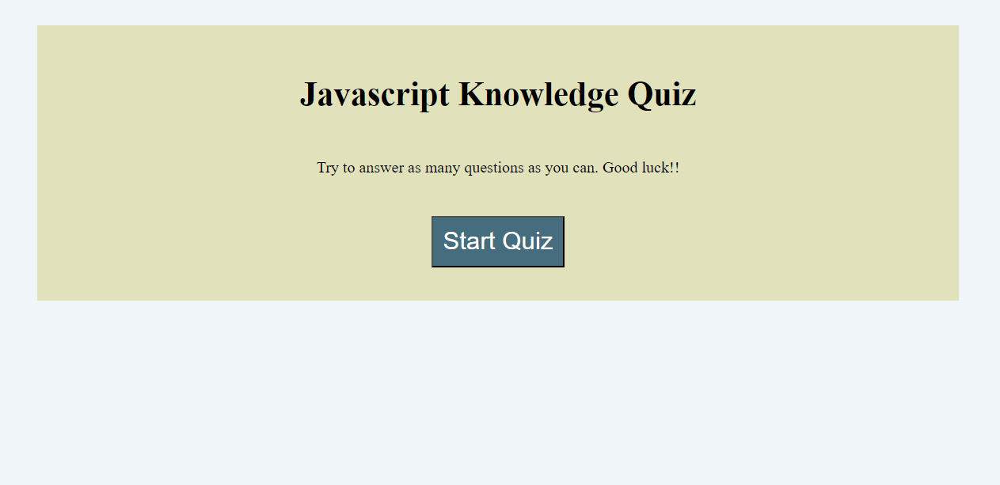

# Javascript-Knowledge-Quiz
## Description
This project tests the user's knowledge of Java. There will be 5 questions for the users to answer, and the time left will be their final score. The faster the user responds the more points they will get. They can then save their score and retry as many times as possible.  

[Go to Website here](https://ari07-ari.github.io/My-Personal-Portafolio-Work/)

## Installation
I created a repository that I later cloned into my computer. Then I created folders with their files, each for html, css and javascript. Then I proceeded to create my code.

## Usage
It can help users refresh and determine how much they know about Java. It is a good way to practice and shows them what parts they are strong and which they need to focus on.

## Credits
The University of Toronto,
Ariana Vinamagua